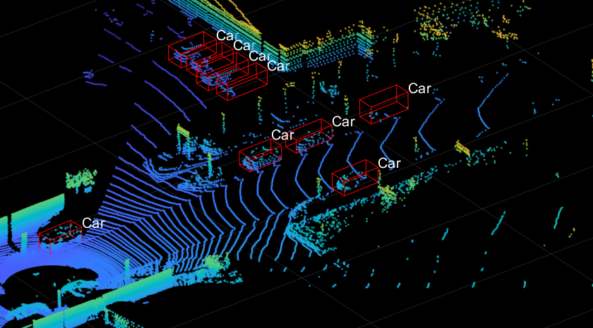
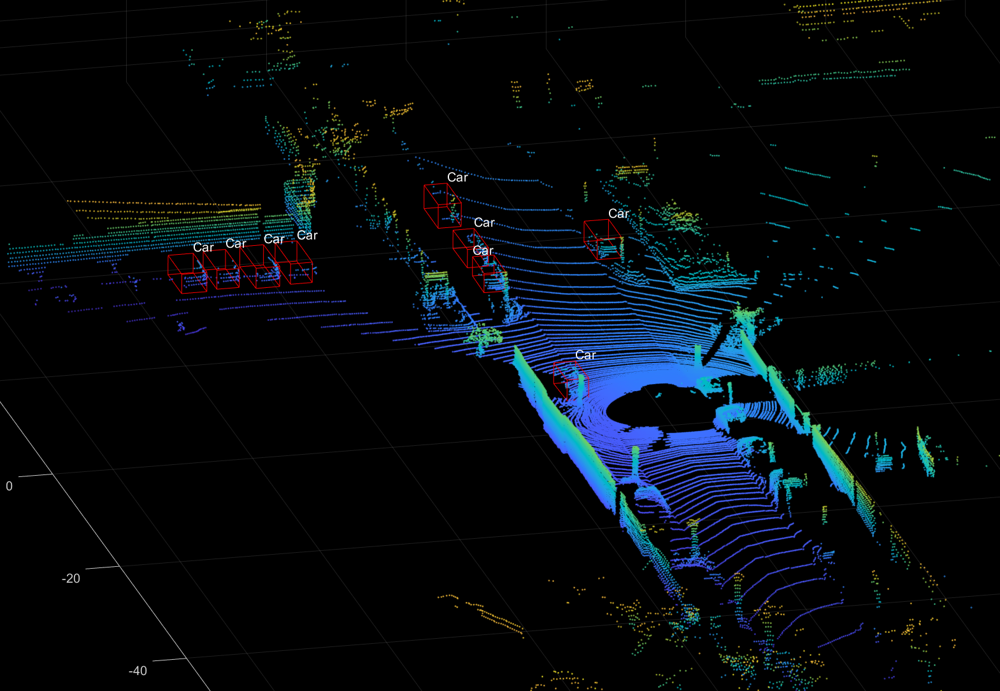
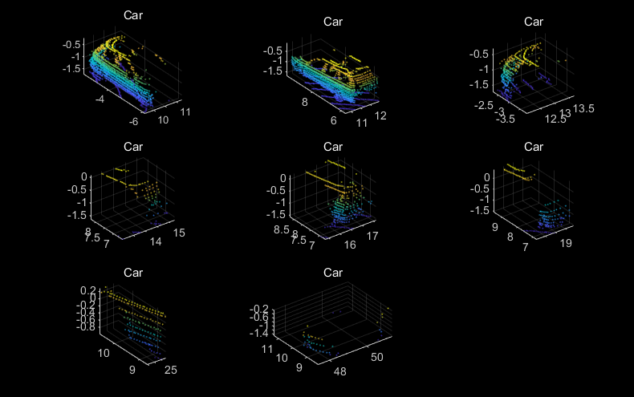
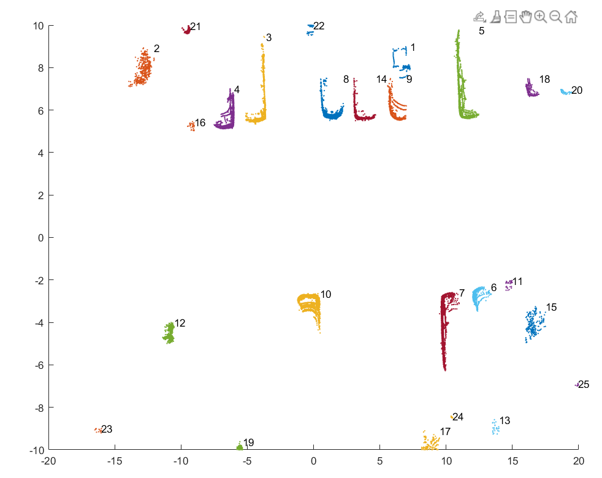
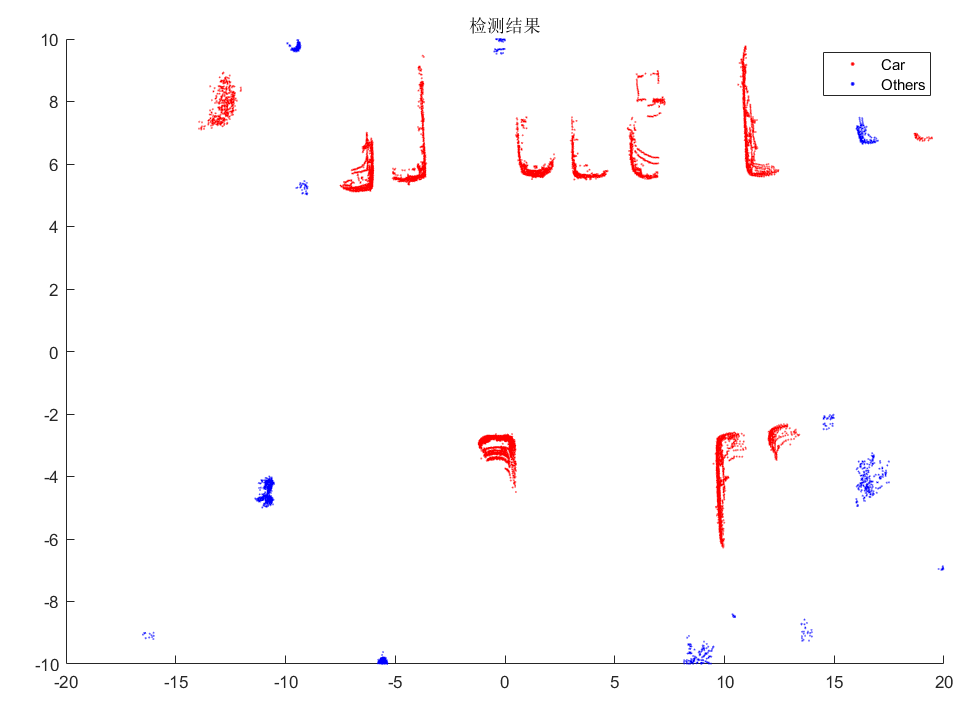
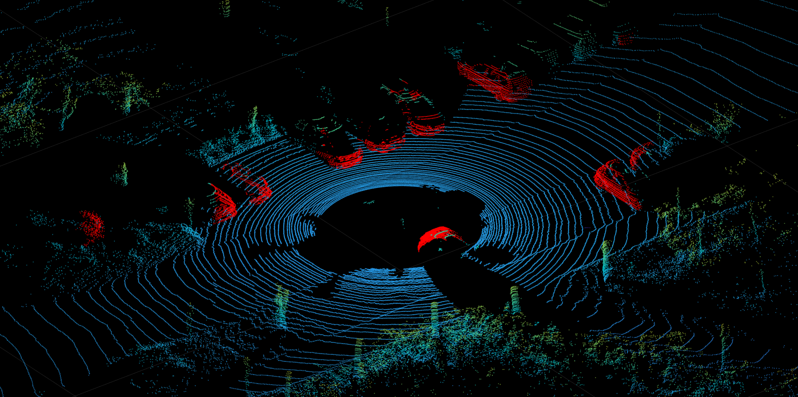

# KITTI-velodyne-viewer-matlab

# 2021.8.13 <strong style="color:red;">update neural network point cloud vehicle detection!!</strong>

1. **What you need to do is just run test.mlx by MATLAB!!! It's so easy, isn't it?**

2. **If you what to train the new model, run the main.py with Python!**

3. **I use the simple MLP to realize this detection project. And the result seems good.**

4. **If you want to know the details about the realization, see my blog:https://blog.csdn.net/weixin_43145941/article/details/119654965**

